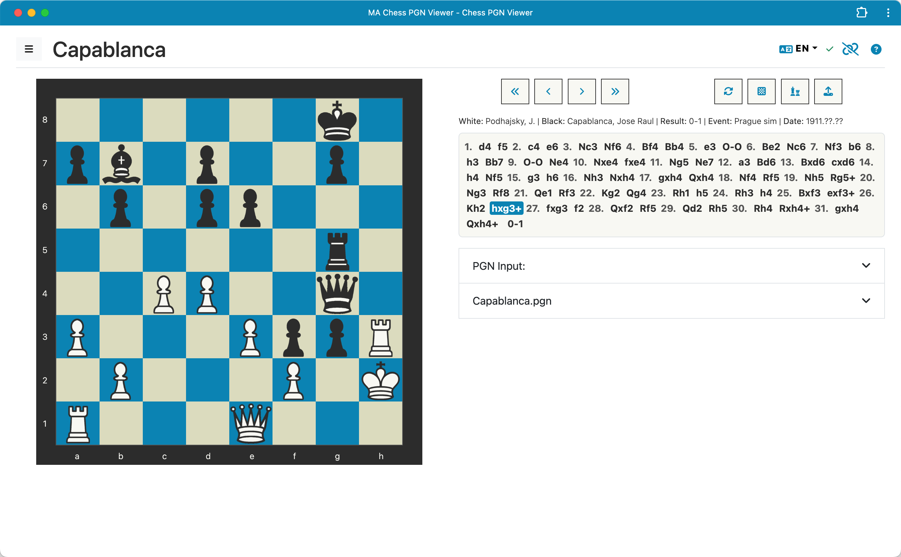

# Chess PGN Viewer

A Progressive Web Application (PWA) for viewing and analyzing chess games stored in Portable Game Notation (PGN) format.

This application allows users to:

* Load PGN files from their local device.
* View chess game metadata (players, event, date, result, etc.).
* Step through games move by move using interactive board controls.
* Visualize the chessboard corresponding to each move.
* Work offline using a Service Worker.
* Utilize a Bootstrap 5 based UI.

## Help

For detailed instructions on how to use the application's features, please see the [Help Page](help/index.html) or the [Markdown Help](help.md).



## Usage for Development

To use this application for development:

1.  **Install Node.js dependencies:**
```bash
npm install
```
This command installs the necessary packages for the development server (currently just used for serving files).

2.  **Start the development server:**
```bash
node node-server.js [--verbose]
```
This command launches the Node.js server, which will serve the PWA locally.

3.  **Optional: Generate local HTTPS certificates:**
To run the server with HTTPS (required for testing certain PWA features like installability more robustly or features requiring a secure context beyond `localhost`), and assuming `mkcert` is installed, generate the certificate files:
```bash
# Run this in the project's root directory
mkcert localhost 127.0.0.1 ::1
```
This generates `localhost+N.pem` and `localhost+N-key.pem` files in the current directory, which the secure server command will automatically use. Only needed to do this once unless the certificates expire or the directory is cleared. It is necessary to run `mkcert -install` once beforehand if you haven't already configured the local CA.

4.  **Start secure server:**
```bash
node node-server.js --secure [--verbose]
```

**Open the PWA in your web browser:**
Once the server is running, you can access the webapp by navigating to the server address in your browser. Typically, this will be `http://localhost:5001` or `https://localhost:8443` if using secure mode.

## Contributing

Contributions to improve this Chess PGN Viewer are welcome. For major changes, please open an issue first to discuss what you would like to change.

## License

This project is licensed under the MIT License - see the [LICENSE](LICENSE) file for details.
